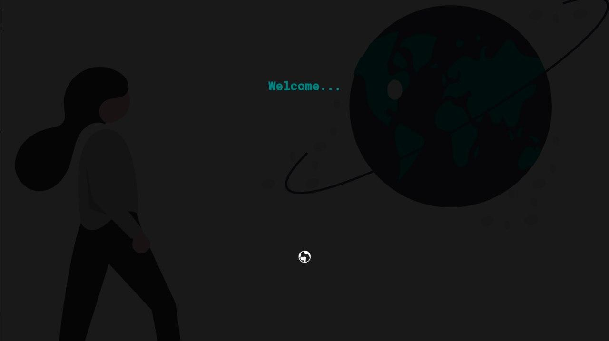
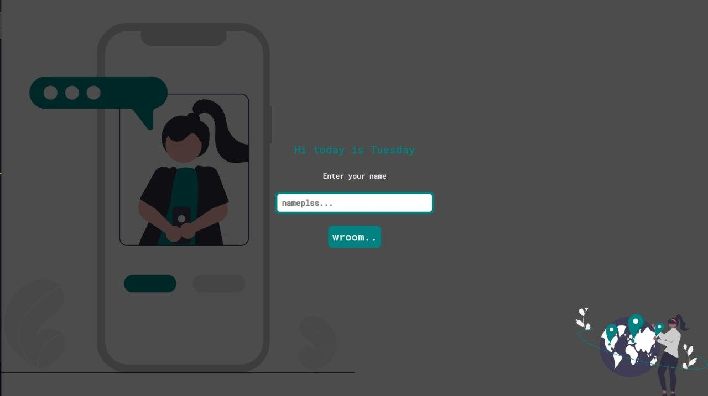
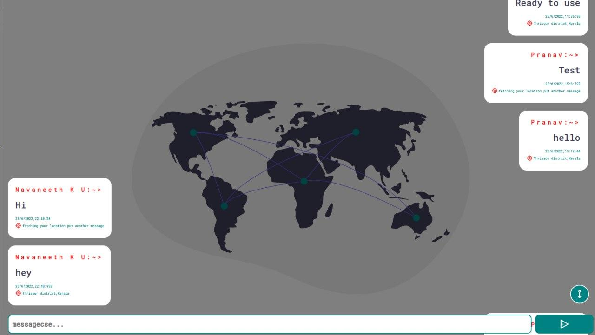
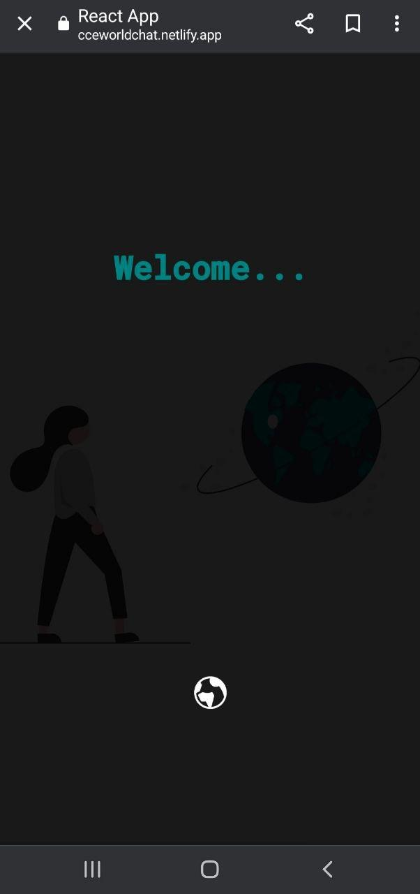
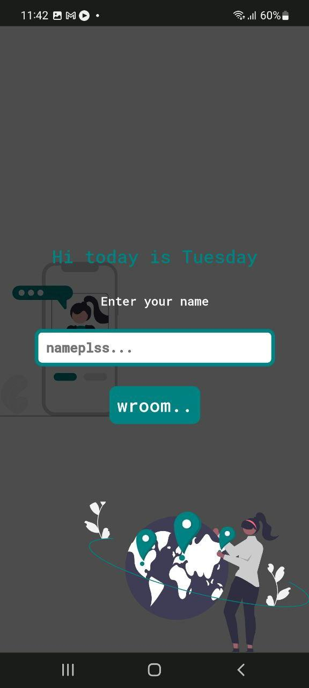
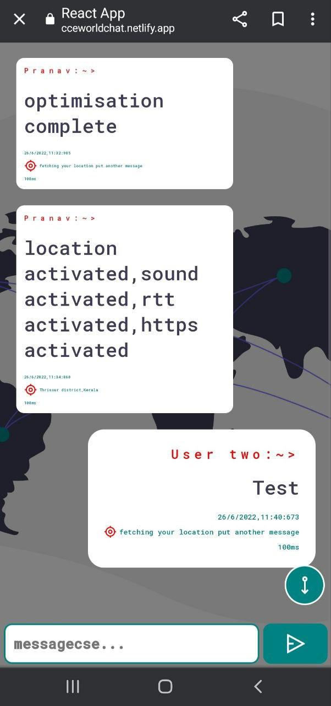

<h1>World-Chat</h1>

This app can be used to chat with any group of people from different parts of the world

This app is optimised for both mobiles as well as pc's

This is a chat application which is created using 
  <ol>
    <li>React JS</li>
    <li>Firebase</li>
  </ol>

 

</b>LIVE LINK : https://cceworldchat.netlify.app/</b>

 
<h2>#Features</h2>
<ul>
  <li>Finding the location of the user</li>
  <li>RTT(round trip time of the user)</li>
  <li>Notification Sound when new message arrives</li>
  <li>Auto-Scroll when new message arrives</li>
  <li>Date of the message arrived</li>
  <li>Time of the message arrived</li>
  <li>More features yet to come..</li>
</ul>
<h2>#Snapshots</h2>

  
  
  

